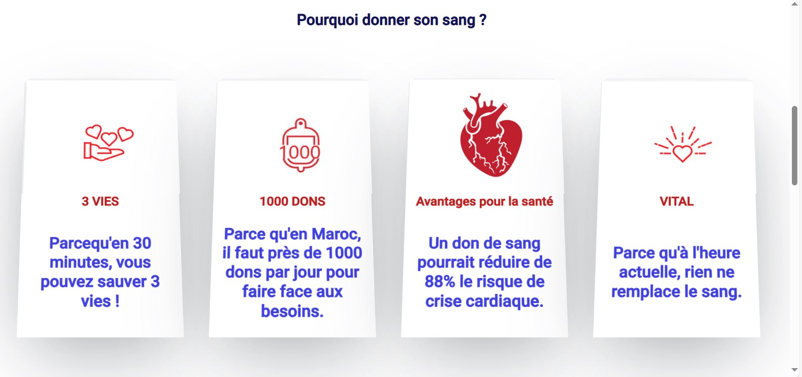

# Blood Donation Website

## Overview
This project is a **Blood Donation Platform** developed using **React.js**, aiming to connect blood donors with recipients efficiently. The website provides a user-friendly interface for registering as a donor, searching for donors, and learning more about the importance of blood donation.

---
## Screenshots




## Features
- **Donor Registration**: Users can register as blood donors by providing their details, including blood group and contact information.
- **Search for Donors**: Find donors based on location and blood group.
- **Awareness Section**: Information about blood donation, its benefits, and guidelines.
- **Responsive Design**: Fully responsive for mobile, tablet, and desktop devices.
- **Contact Us**: Allows users to get in touch for more information or queries.

---

## Technologies Used
- **Frontend**: React.js, HTML5, CSS3, JavaScript
- **State Management**: React Context API or Redux (optional)
- **Styling**: Bootstrap, Tailwind CSS, or Material-UI
- **Routing**: React Router
- **Icons**: FontAwesome, Material Icons

---

## Installation and Setup
Follow these steps to set up the project locally:

1. Clone the repository:
   ```bash
   git clone <repository_url>
   cd <project_folder>
